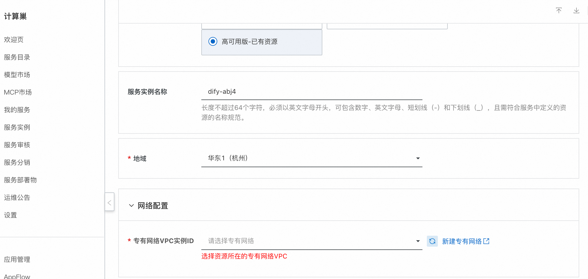
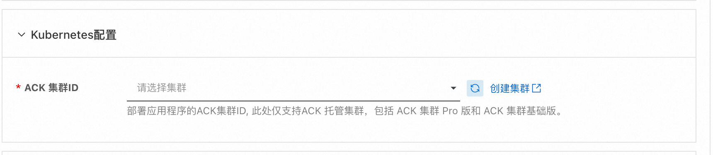
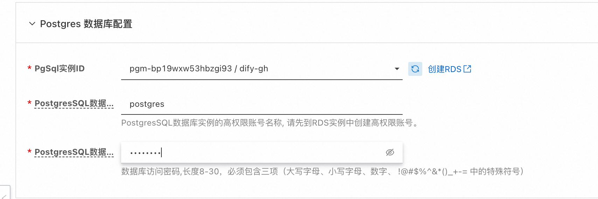
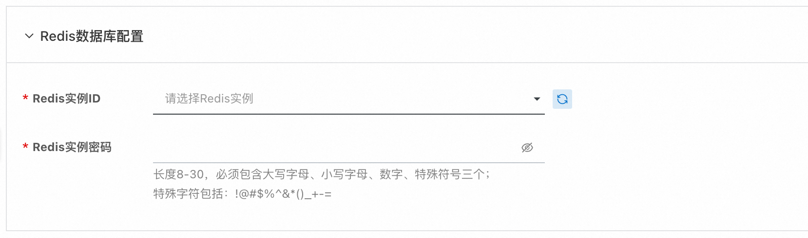
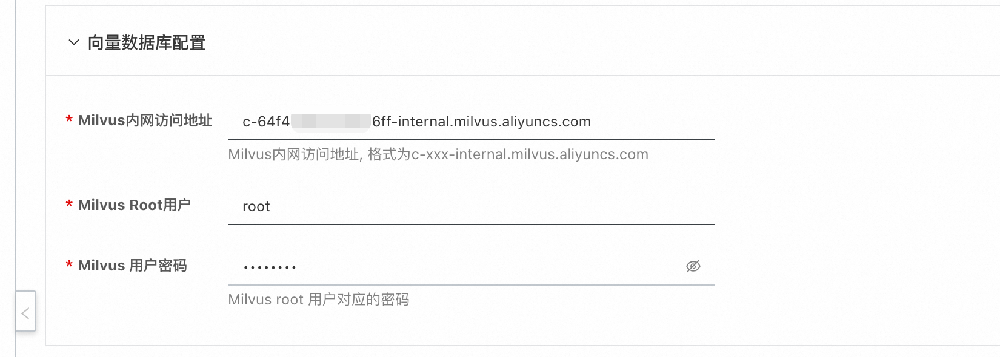
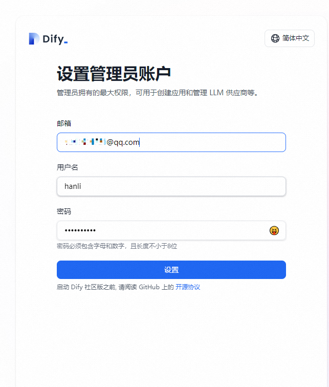
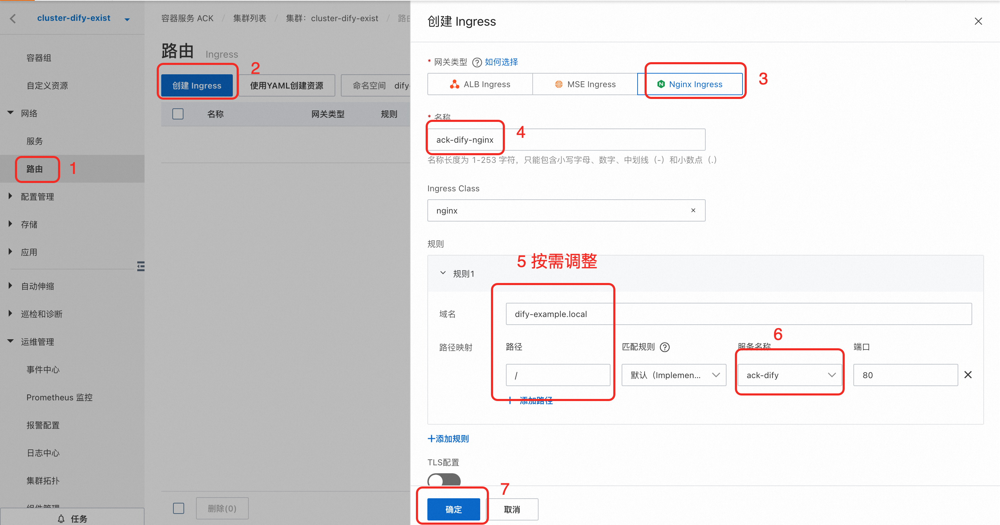

# Dify计算巢快速部署

>**免责声明：**本服务由第三方提供，我们尽力确保其安全性、准确性和可靠性，但无法保证其完全免于故障、中断、错误或攻击。因此，本公司在此声明：对于本服务的内容、准确性、完整性、可靠性、适用性以及及时性不作任何陈述、保证或承诺，不对您使用本服务所产生的任何直接或间接的损失或损害承担任何责任；对于您通过本服务访问的第三方网站、应用程序、产品和服务，不对其内容、准确性、完整性、可靠性、适用性以及及时性承担任何责任，您应自行承担使用后果产生的风险和责任；对于因您使用本服务而产生的任何损失、损害，包括但不限于直接损失、间接损失、利润损失、商誉损失、数据损失或其他经济损失，不承担任何责任，即使本公司事先已被告知可能存在此类损失或损害的可能性；我们保留不时修改本声明的权利，因此请您在使用本服务前定期检查本声明。如果您对本声明或本服务存在任何问题或疑问，请联系我们。

## 概述

Dify.AI 是一款 LLMOps 平台，帮助开发者更简单、更快速地构建 AI 应用。它的核心理念是通过可声明式的 YAML 文件定义 AI 应用的各个方面，包括 Prompt、上下文和插件等。Dify 提供了可视化的 Prompt 编排、运营、数据集管理等功能。这些功能使得开发者能够在数天内完成 AI 应用的开发，或将 LLM 快速集成到现有应用中，并进行持续运营和改进，创造一个真正有价值的 AI 应用。
本方案提供了部署Dify的最佳实践，基于阿里云ACK部署的Dify支持高可用、弹性伸缩等能力，且同时支持集成云数据库, 可以实现Dify稳定、高性能部署，推荐用于生产环境。

## 前提条件

部署Dify社区版服务实例，需要对部分阿里云资源进行访问和创建操作。因此您的账号需要包含如下资源的权限。
  **说明**：当您的账号是RAM账号时，才需要添加此权限。

| 权限策略名称                          | 备注                     |
|---------------------------------|------------------------|
| AliyunECSFullAccess             | 管理云服务器服务（ECS）的权限       |
| AliyunVPCFullAccess             | 管理专有网络（VPC）的权限         |
| AliyunROSFullAccess             | 管理资源编排服务（ROS）的权限       |
| AliyunCSFullAccess              | 管理容器服务（CS）的权限   |
| AliyunROSFullAccess             | 管理资源编排服务（ROS）的权限       |
| AliyunKvstoreFullAccess         | 管理云数据库Tair（兼容 Redis）的权限      |
| AliyunRDSFullAccess             | 管理云数据库服务（RDS）的权限      |
| AliyunMilvusFullAccess          | 管理 Milvus 的权限      |
| AliyunComputeNestUserFullAccess | 管理计算巢服务（ComputeNest）的用户侧权限 |

## 计费说明

Dify社区版在计算巢部署的费用主要涉及：

- 所选vCPU与内存规格
- 系统盘类型及容量
- 公网带宽
- 所选的云数据库的规格

## 部署架构

  Dify应用的组件主要包括业务组件和基础组件两大类，业务组件包括：api/worker、web、sandbox。基础组件包括：db、verctor db、redis、nginx、ssrf_proxy。
此方案中业务组件部署在ACK容器中，基础组件均使用云数据库，本方案支持选择已有云数据库和已有ACK 容器集群，需要注意，**所有的云资源需要位于同一个VPC网络中**

## 部署流程
1. 访问计算巢Dify社区版[部署链接](https://computenest.console.aliyun.com/user/cn-hangzhou/serviceInstanceCreate?ServiceId=service-c8afb895dd314f70a020)按提示填写部署参数： 
 模板选择"高可用版-已有资源"，首先选择部署地域和专有网络，注意所有的资源都需要位于选择的VPC网络中。
    
 选择该VPC中，需要部署的ACK容器集群，如果没有合适的集群，需要在该VPC中创建一个
  
 配置Postgres数据库，选择该VPC中，要使用的Postgres数据库，需要传入该数据库的高权限账号和对应的密码
  
 配置Redis数据库，选择该VPC中，要使用的Redis数据库，需要传入该数据库的密码。
   
 配置向量数据库，选择该VPC中，要使用的Milvus实例, 需要配置Milvus数据库的内网访问地址，和root用户对应的密码
   
 建议开启高可用配置，开启后可以提高应用的容灾能力和对峰值负载的处理能力。
2. 参数填写完成后可以看到对应询价明细，确认参数后点击**下一步：确认订单**。 确认订单完成后同意服务协议并点击**立即创建**
   进入部署阶段。
3. 等待部署完成后就可以开始使用服务，在选择已有资源的场景中，避免对您已有资源产生影响，需要按照使用说明到ACK集群中手动配置访问入口。
4. 注册账号。
    
5. 登录就能创建自己的dify应用了
    

## 使用说明
  ### 配置访问入口
  如果选择已有ACK集群进行部署，需要手动配置访问入口, 推荐两种方式
  
  **方式一：** 通过负载均衡访问，按照如下步骤进行配置
  
  配置完成后，您会看到ack-dify服务的外部IP地址（External IP），将该外部IP地址输入浏览器地址栏即可访问Dify服务。
  

  **方式二：** 通过配置Ingress访问，按照如下步骤进行配置
  首先集群中安装Nginx Ingress Controller组件，再配置相关路由，按照如下步骤配置
  
  配置完成后，您会看到Ingress的端点，将此端点对域名绑定host或配置解析后，即可通过域名访问Dify。
  

 ### 配置Dify 服务的弹性伸缩
   如果希望实现弹性扩缩容，
   节点的弹性扩缩容可以参考此文档进行[配置](https://help.aliyun.com/zh/ack/ack-managed-and-ack-dedicated/user-guide/auto-scaling-of-nodes?spm=a2c4g.11186623.help-menu-85222.d_2_12_1_0.9ae546c6P5Pf9i)。
   负载的弹性伸缩可以打开部署页面的“高可用”开关
   
## 基于 Nacos 实现 MCP Server 集中管理
Dify自1.6.0版本后官方支持了MCP Server, 对接 Nacos MCP Registry 可以实现 MCP Server 集中管理。
Nacos 3.0 版本实现了 MCP Registry 管理功能，可以对所有的MCP Server 进行集中式的管理。Dify 应用通过接入 Nacos MCP 插件，基于 Nacos MCP Registry，可以实现以下功能：
1. MCP Server 自动注册和动态发现: 支持多实例注册分布式部署，提高容灾能力。支持标准 MCP Server 注册，以及存量的微服务 API 0代码改动转化成 MCP 服务。
2. MCP Server 运行时信息动态管理: 工具描述运行时动态修改生效，帮助 MCP Server 快速调优迭代。MCP Tools 动态开关，动态调整暴露工具列表。MCP Server 版本管理。
3. MSE Nacos 支持 MCP Registry 管理功能，高可用，高性能， 高性能，具体接入和使用教程，请参考：[Dify Nacos MCP 插件使用教程与最佳实践](https://help.aliyun.com/zh/mse/use-cases/dify-docking-with-nacos-mcp-registry-to-realize-centralized-management-of-mcp-server) .
您也可以通过部署开源 Nacos 3.x 进行试用，接入文档：[开源接入文档](https://nacos.io/docs/latest/manual/user/ai/dify-nacos-mcp/?spm=5238cd80.2ef5001f.0.0.3f613b7cC9m8vz)
