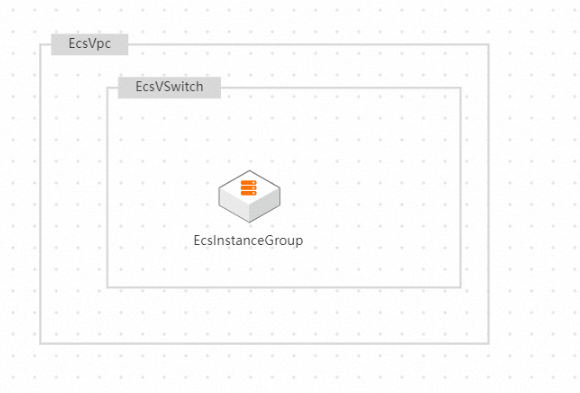
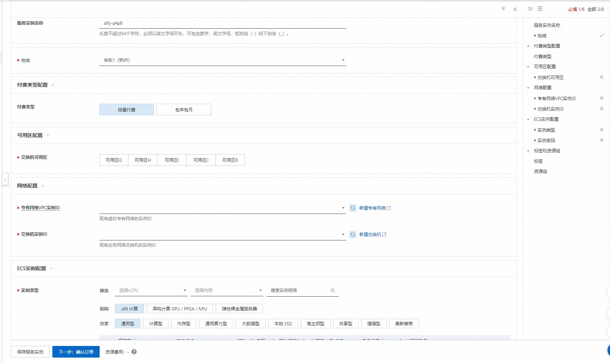
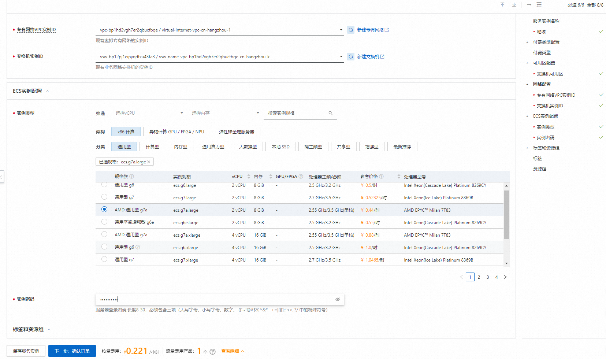
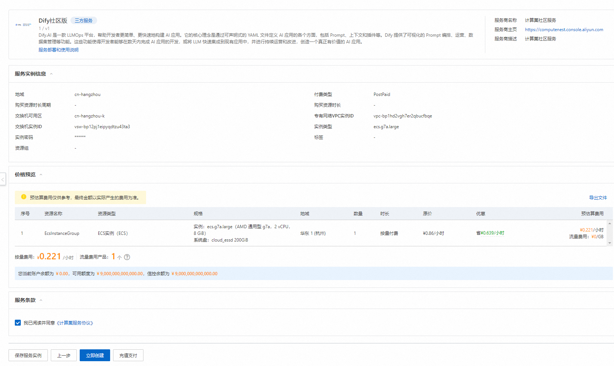
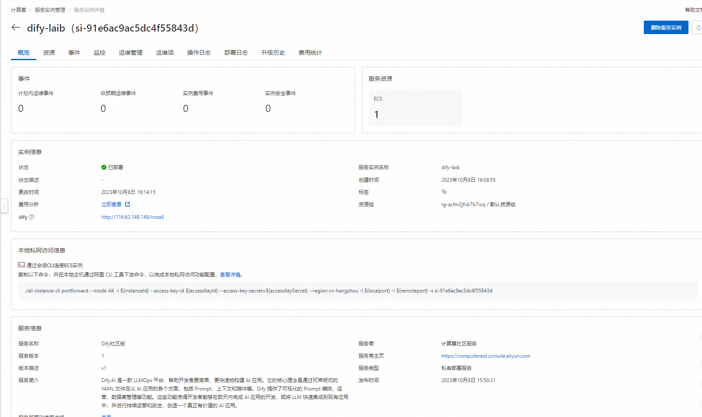

<blockquote>

<strong> Disclaimer:</strong> This service is provided by a third party. We try our best to ensure its security, accuracy and reliability, but we cannot guarantee that it is completely free from failure, interruption, error or attack. Therefore, the company hereby declares that it makes no representations, warranties or commitments regarding the content, accuracy, completeness, reliability, suitability and timeliness of the Service and is not liable for any direct or indirect loss or damage arising from your use of the Service; for third-party websites, applications, products and services that you access through the Service, do not assume any responsibility for its content, accuracy, completeness, reliability, applicability and timeliness, and you shall bear the risks and responsibilities of the consequences of use; for any loss or damage arising from your use of this service, including but not limited to direct loss, indirect loss, loss of profits, loss of goodwill, loss of data or other economic losses, even if we have been advised in advance of the possibility of such loss or damage; we reserve the right to amend this statement from time to time, so please check this statement regularly before using the Service. If you have any questions or concerns about this Statement or the Service, please contact us. 

</blockquote>

<h2> Overview </h2>

Dify.AI is an LLMOps platform that helps developers build AI applications easier and faster. Its core idea is to define all aspects of an AI application through declarable YAML files, including prompts, contexts, and plug-ins. Dify provides functions such as visual Prompt orchestration, operation, and data set management. These capabilities enable developers to complete the development of AI applications in days, or quickly integrate LLM into existing applications, and continue to operate and improve to create a truly valuable AI application.
This method provides a solution for deploying a stand-alone version of Dify, and quickly deploys Dify through Docker Compose. This deployment method does not have high availability and scalability characteristics, is not suitable for use in a production environment, and is recommend used for development testing. 

<h2> Prerequisites </h2>

 To deploy a Dify Community Edition service instance, you need to access and create some Alibaba Cloud resources. Therefore, your account must contain permissions for the following resources.
<strong> Note </strong>: This permission is required only when your account is a RAM account. 

<table>
<thead>
<tr>
<th> Permission policy name </th>
<th> Remarks </th>
</tr>
</thead>
<tbody>
<tr>
<td>AliyunECSFullAccess</td>
<td> Permissions to manage ECS </td>
</tr>
<tr>
<td>AliyunVPCFullAccess</td>
<td> Permissions for managing VPC networks </td>
</tr>
<tr>
<td>AliyunROSFullAccess</td>
<td> Manage permissions for Resource Orchestration Services (ROS) </td>
</tr>
<tr>
<td>AliyunComputeNestUserFullAccess</td>
<td> Manage user-side permissions for the compute nest service (ComputeNest) </td>
</tr>
</tbody>
</table>

<h2> Billing instructions </h2>

 The cost of Dify Community Edition deployment in the computing nest mainly involves:

<ul>
<li> Selected vCPU and Memory Specifications </li>
<li> System disk type and capacity </li>
<li> Internet bandwidth </li>
</ul>

<h2> Deployment Architecture </h2>

<h2> Parameter description </h2>

<table>
<thead>
<tr>
<th> Parameter group </th>
<th> Parameter item </th>
<th> Description </th>
</tr>
</thead>
<tbody>
<tr>
<td> Service instance </td>
<td> Service instance name </td>
<td> It must be no more than 64 characters in length and must start with an English letter. It can contain numbers, English letters, dashes (-), and underscores (_). </td>
</tr>
<tr>
<td></td>
<td> Region </td>
<td> Region where the service instance is deployed </td>
</tr>
<tr>
<td></td>
<td> Payment type </td>
<td> Resource billing type: Pay-As-You-Go and Subscription </td>
</tr>
<tr>
<td>ECS instance configuration </td>
<td> Instance type </td>
<td> Instance specifications available in the zone </td>
</tr>
<tr>
<td></td>
<td> Instance password </td>
<td> is 8-30 in length and must contain three items (uppercase letters, lowercase letters, numbers, ()'~!@#$%^& *-+ =|{}[]:' <>,./special symbols)</td>
</tr>
<tr>
<td> Network configuration </td>
<td> Availability Zone </td>
<td> Zone where the ECS instance is located </td>
</tr>
<tr>
<td></td>
<td>VPC ID</td>
<td> VPC where the resource is located </td>
</tr>
<tr>
<td></td>
<td> Switch ID</td>
<td> Switch where the resource is located </td>
</tr>
</tbody>
</table>

<h2> Deployment process </h2>

<ol>
<li>
 Visit Compute Nest Dify Community Edition <a href = "https://computenest.console.aliyun.com/user/cn-hangzhou/serviceInstanceCreate?ServiceId=service-c8afb895dd314f70a020"> Deployment link </a>
, fill in the deployment parameters as prompted:

</li>
<li>
 after the parameters are filled in, you can see the corresponding inquiry details. after confirming the parameters, click <strong> next: confirm the order </strong>.

</li>
<li>
 Confirm the order and agree to the service agreement and click <strong> Create now </strong>
Enter the deployment phase.

</li>
<li>
 After the deployment is completed, you can start using the service. Click the dify link to enter the service instance details.

</li>
<li>
 Register your account.

</li>
<li>
 login to create your own dify application

</li>
</ol>
